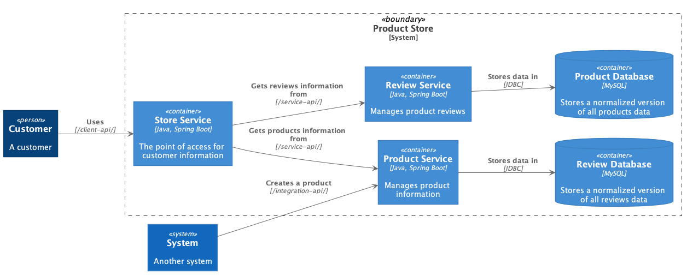

# Backbase Golden Sample MicroServices system

- This project is a development of a small set of [Backbase Service SDK](https://community.backbase.com/documentation/ServiceSDK/latest/index) (**Spring Boot** and **Cloud**) based Microservices projects that implement cloud-native intuitive, Microservices design patterns, and coding best practices.
- The project follows [**CloudNative**](https://www.cncf.io/) recommendations and the [**twelve-factor app**](https://12factor.net/) methodology for building *software-as-a-service apps* to show how μServices should be developed and deployed.
- This project uses technologies used in broadly Backbase like Docker, Kubernetes, Java SE 11, Spring Boot, Spring Cloud, 
TestContainers and Liquibase among others, all components covering integration & performance testing, and many more.
 - This project is going to be developed as stages
---
## Description
### System Structure
Let's explain first the system structure to understand its components:
```
Backbase Golden Sample --> Parent folder. 
|- config --> All system configuration files 
|- config-server --> Centralized Configuration server
|- diagrams --> All docs and diagrams. 
|-database 
  |- assembly --> API specification linters. 
  |- docs  
  |- product-db
  |- review-db
|-api 
  |- product-api  
    |- src/main/resources
       |- product-integration-api-v1.yaml
       |- product-service-api-v1.yaml
  |- review-service-api 
    |- src/main/resources 
       |- openapi-v1.yaml
  |- store-client-api  
    |- src/main/resources 
       |- openapi-v1.yaml
|-services 
  |- product --> Product Microservice 
  |- review --> Review Microservice 
  |- store --> Store Microservice 
|- docker-compose.yml --> contains all services landscape including infra like MySQL, RabbitMQ, Zipkin, Prometheus, etc 
```
Now, as we have learned about different system components, then let's start.

### System Boundary - Microservices Landscape

The microservice-based system landscape that we will use it consists of two core microservices, the Product, 
Review and services, all of which deal with one type of resource, and a composite microservice called the Product Composite service, which aggregates information



To keep the source code easy to understand, they have a minimal amount of business logic. 
The information model for the business objects they process is kept minimal for the same reason. 
In this section, we will go through the information that's handled by each microservice, plus infrastructure-related 
information that microservices handle.


#### Product service 
The product service manages product information and describes each product with the following attributes: 
* Product ID 
* Name 
* Weight
* Creation Date

#### Review service 
The review service manages product review and stores the following information about each review: 
* Product ID 
* Review ID 
* Author 
* Subject 
* Content

#### Store service
The store service is a product composite service that aggregates information from the core services and 
presents information about a product as follows: 
* Product information, as described in the *product* service 
* A list of product reviews for the specified product, as described in the *review* service 


### Required software

The following are the initially required software pieces:

1. **Backbase SDK**

2. **Git**: it can be downloaded and installed from https://git-scm.com/downloads.

3. **Java 11 EA**: it can be downloaded and installed from https://jdk.java.net/11/.

4. **Spring Boot Initializer**: This *Initializer* generates *spring* boot project with just what you need to start quickly! Start from here https://start.spring.io/.

5. **Docker Desktop**: The fastest way to containerize applications on your desktop, and you can download it from here [https://www.docker.com/products/docker-desktop](https://www.docker.com/products/docker-desktop)

   > For each future stage, We will list the newly required software. 

Follow the installation guide for each software website link and check your software versions from the command line to verify that they are all installed correctly.

## Using an IDE

We recommend that you work with your Java code using an IDE that supports the development of Spring Boot applications such as Spring Tool Suite or IntelliJ IDEA Ultimate Edition. So you can use the Spring Boot Dashboard to run the services, run each microservice test case, and many more.

All that you want to do is just fire up your IDE **->** open or import the parent folder `backbase-golden-sample,` and everything will be ready for you.

## Playing With Backbase Golden Sample Project

### Cloning It

The first thing to do is to open **git bash** command line, and then simply you can clone the project under any of your favorite places as the following:

```bash
> git clone 
```

------
This project will be developed in steps, and each such step will be a release in its own, so you can go back and forward between versions to see the differences and how adding things solve specific problems we face.

The main idea of the project for now is three microservices: **Store**, **Product** and **Review**. **Product** and **Review** microservices are CRUD applications saving data in a MySQL Database, and **Store Service** calls the other two services (*Product* and *Review*) statically to generate client aggregate response for a specific product. 

### Steps

https://github.com/Backbase/golden-sample-services/issues

- [ ] Step 1: create project structure, essential
               services' skeleton, integration between them, and finally, write integration testing as well as semi-automated testing for the complete services' functionality.
- [ ] Step 2 Add **openAPI** specs and generate code from them
- [ ] Step 3 Add data layer
    - [ ] **database integration** 
    - [ ] and **Liquibase**       
- [ ] Step 4 Add **Dockerization** of our services and **docker-compose**
- [ ] Step 5 Add **External config** using Spring Cloud Config
- [ ] Step 6 Introduce **service discovery**
- [ ] Step 7 Introduce Security via **Backbase Identity**
- [ ] Step 8 Introduce **Multitenancy** via https://community.backbase.com/documentation/ServiceSDK/latest/multitenancy_configuration
- [ ] Step 9 events and https://www.asyncapi.com/
- [ ] Step 10 Introduce Resilience
- [ ] Step 11 Introduce Helm Charts

## Getting started

The first stage, aka (**Release v1.0**), is about creating and implementing a set of Microservices exposing a RestAPI 
and with Database access.

### Creating a Set of communicating Microservices (Release v1.0)

The following points are covered in this 1st stage (other stages topics will be documented in each release notice):

- Introducing the microservice landscape as a diagram.
- Generating skeleton for **Store**, **Product**, and **Review** microservices.
- Adding RESTful APIs.
- Adding Data layer
- Developing automated microservices integration tests in isolation.
- Developing Blackbox automated tests to the microservice landscape.

#### Resources
- We will add more business concepts while keeping the project software stack updated to the most recent software versions. 
Besides, adding more use cases and problems, ours teams are facing in a day by day work.
- The book [Hands-On Microservices With Spring Boot and Spring
   Cloud book by Packt Publishing](https://www.packtpub.com/web-development/hands-on-microservices-with-spring-boot-and-spring-cloud).
- [CloudNative](https://www.cncf.io/) recommendations.
- [Twelve-Factor application](https://12factor.net/).
- [Spring Cloud framework](https://spring.io/projects/spring-cloud).
- [Spring Boot framework](https://spring.io/projects/spring-boot).

#### Contributions

Please create a branch and a PR with your contributions.
Commit messages should follow [semantic commit messages](https://seesparkbox.com/foundry/semantic_commit_messages)
